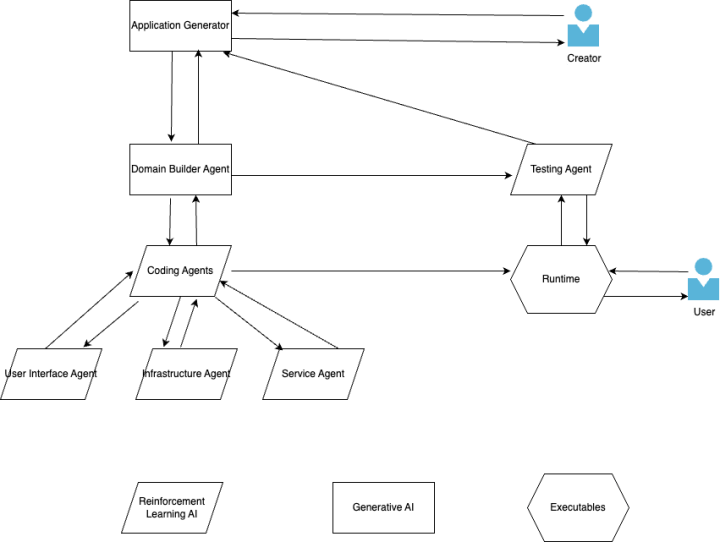

> "AI created software is coming faster and faster. And the technology to do it is already here. All that is needed is training data and a focus."

Artificial Intelligence will create, test, and deliver software products with accuracy, efficiency, and security. Specialized AI agents will coordinate development across distinct lifecycle phases at inhuman speeds.

## How Will It Work?

A software creator describes their product to an Application Generator (AG), which uses large language models to analyze requirements and interact with the creator to refine them. The AG works alongside a Domain Modeler to establish specifications using domain-specific language.

Once the model is validated, specialized Coding Agents build the software:

- **User Interface Agent**: Develops the front-end with intuitive, responsive interfaces
- **Infrastructure Agent**: Handles databases, infrastructure as code, and shared services
- **Service Agent**: Creates business logic and service layers

After development and initial testing (security, unit tests, performance), a Testing Agent performs comprehensive evaluation including functionality, usability, and load testing.

## 1. Revolutionizing Software Engineering with AI

> "Software engineering is a set of repeatable tasks."

AI impacts multiple lifecycle areas:

**Design**: Most software follows similar foundational principles. Agents can leverage established best practices to deliver optimal outcomes.

**Coding**: Programming languages operate as grammars with foundational components. While implementations vary, superior approaches exist, creating a finite set of optimal solutions.

**Testing**: Synthetic data generation combined with reinforcement training, alongside Large Action Models, could produce genuinely bug-free software—architecture or business logic flaws notwithstanding.

**Support Lifecycle**: AI can write user documentation during development, manage documentation, respond to support tickets, and create dynamic bindings between software versions.

## 2. The Evolution of Software Practices

**Source Control**: Feature flagging becomes more relevant, providing agents better context about capabilities and testing requirements.

**Requirements Tracking**: Historical context and current state documentation retain value for AI-driven development conversations with software creators.

**Software Security**: Security testing persists through specialized agents, while Application Generators and Domain Builders better handle access controls and business logic security.

## 3. Behavioral Psychology: Adapting to Rapid Changes

**Impact on Users**: Rapid release cycles risk user fatigue. Keeping pace with continuous feature deployment can reduce productivity as users struggle with perpetual change.

**The Creator's Paradox**: While execution costs decrease through automation, decision complexity increases. Software creators must balance rapid change capability against decision fatigue and user stability needs.

> "Software is going to be created and changed at speeds that we are not used to."

Both product owners and users require adjustment as development velocity accelerates dramatically.
