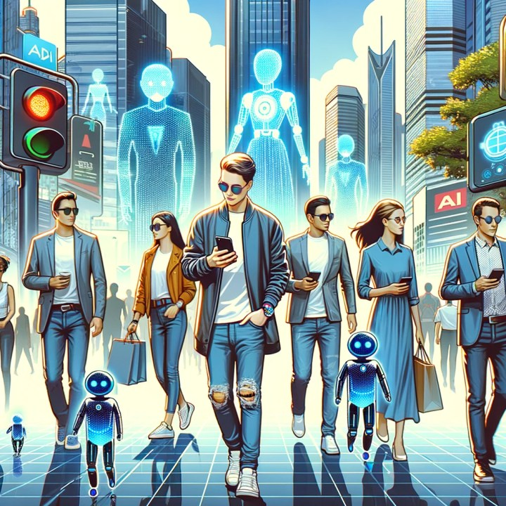

Alexa, Siri, and Jarvis represent the promise of artificial intelligence making life simpler. These digital assistants claim to understand us better than we understand ourselves, with smart devices coordinating to enhance productivity and reduce daily stress.

However, history suggests caution. Social media was similarly promoted as fostering global connection and empathy, yet delivered disappointingly different results.

## The Upside: Convenience and Efficiency

AI assistants provide genuine practical benefits. They can analyze calendars, traffic patterns, and flight schedules to notify users precisely when to depart for appointments. Such systems reduce both time investment and anxiety about punctuality.

These tools also excel at group coordination. By evaluating everyone's preferences, locations, and availability, AI assistants can recommend optimal meeting times and venues that accommodate entire groups, strengthening social bonds through easier coordination.

## The Downside: Over reliance and Isolation

Greater convenience carries hidden costs. As these systems become increasingly capable and integrated, we risk outsourcing essential decisions and problem-solving tasks. The article notes that "humans need to regularly put themselves in situations that challenge them, expose them to new experiences, and force them to adapt and grow."

Over-reliance on efficiency-focused systems could shield people from experiences necessary for personal development. Current trends show declining phone conversations as texting becomes dominant—imagine the shift if even messaging became unnecessary.

Furthermore, AI assistants optimizing for user preferences may inadvertently reinforce echo chambers, limiting exposure to diverse viewpoints and narrowing worldviews through preference-aligned recommendations.

## The Paradox of Programmed Empathy

Modern AI assistants demonstrate sophisticated emotional intelligence, creating natural and relatable interactions. Yet this raises psychological concerns: will seamless virtual empathy create unrealistic expectations for human relationships?

As people grow accustomed to perfectly responsive AI support, frustration with ordinary human limitations may increase. Heavy reliance on artificial emotional support could undermine development of authentic human connections and interpersonal competencies.

The author poses a critical question: "will there be a significant impairment to social cues and emotional growth in kids that will be impossible to overcome?" mirroring documented concerns about screen time's developmental effects.

## Finding the Right Balance

These technologies represent double-edged tools requiring careful integration. Rather than abandoning responsibility to AI systems, users should leverage them to enhance capabilities while preserving time for meaningful pursuits.

Maintaining exposure to challenging experiences, diverse perspectives, and novel situations remains essential for resilience and growth. Crucially, people must recognize that despite their appeal, AI assistants cannot replace authentic human connection.

The ultimate impact depends on informed, intentional adoption. By remaining conscious of potential pitfalls while actively pursuing equilibrium, society can harness digital assistance while protecting the irreplaceable human experiences that genuinely enrich existence.
