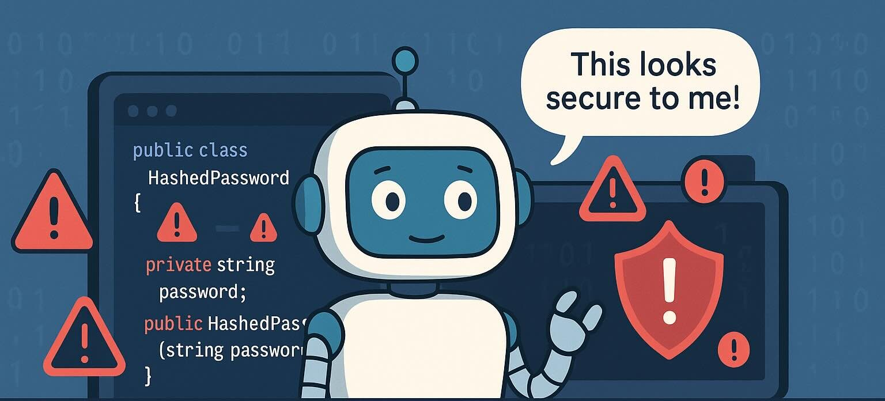

Posted on June 8, 2025

I've been exploring AI code generation while building a Domain Driven Design framework focused on security. Implementing a HashPassword value object revealed significant challenges with how AI handles sensitive data patterns.

## Why Value Objects Matter (The Good News First)

Value objects strengthen secure software development in several ways:

**Strong Typing That Actually Types**

Instead of passing generic `String` parameters, value objects create distinct types. IDEs and compilers catch type mismatches before runtime, preventing developers from accidentally swapping usernames for password hashes.

**Readability That Reads**

Clear method signatures like `processLogin(UserId userId, HashedPassword password)` communicate intent immediately. This eliminates ambiguity about parameter purposes.

**Validation Where It Belongs**

Validation at construction time centralizes security checks. Once you have a valid `HashedPassword` object, you know it meets your criteria.

## The Implementation That Seemed So Right

Here's an initial approach that appears sound at first glance:

```java
/**
 * Represents a securely hashed password.
 * This object encapsulates the full hash string, which should include
 * the algorithm, salt, cost factors, and the hash itself.
 * It does not store the plaintext password.
 */
public record HashedPassword(String fullHash) implements ValueObject {

    /**
     * Canonical constructor.
     *
     * @param fullHash The complete password hash string (e.g., output from Argon2, bcrypt, scrypt).
     *                 Must not be null or blank.
     * @throws IllegalArgumentException if fullHash is null or blank.
     */
    public HashedPassword {
        Objects.requireNonNull(fullHash, "fullHash cannot be null");
        if (fullHash.isBlank()) {
            throw new IllegalArgumentException("fullHash cannot be blank");
        }
    }

    /**
     * Provides the full hash string.
     *
     * @return The password hash.
     */
    public String value() {
        return fullHash;
    }

    // equals, hashCode, and toString are automatically generated by the record.
    // toString will print the hash, which is generally acceptable as it's not the plaintext.
}
```

This uses modern Java records with validation, yet multiple security flaws lurk within.

## Flaw #1: The Data Leakage

Java records automatically generate a `toString()` method that exposes all fields without consideration for data sensitivity.

**The Problem**

Default implementations broadcast password hashes to logs, exception handlers, debugging sessions, and stack traces. The comment claiming "the hash isn't plaintext" creates dangerous assumptions about exposure risk.

**The Reality Check**

While hashes don't reveal original passwords, they remain valuable targets. Attackers can leverage them for timing attacks, brute-force with rainbow tables, and reconnaissance about password policies. "It's just a hash" becomes implicit permission to ignore security in future maintenance.

**The Fix**

Override `toString()` to return safe output:

```java
@Override
public String toString() {
    return "HashedPassword[REDACTED]";
}
```

## Flaw #2: The Memory Persistence Problem

Java's immutable `String` class persists in memory far longer than intended. After your `HashedPassword` object becomes unreachable, the hash string may linger in heap memory until unpredictable garbage collection cycles run.

**The Architectural Tension**

Value objects require immutability, yet secure memory handling demands explicit cleanup. Consider these approaches:

1. Accept memory exposure while using defensive `byte[]` copying
2. Move security concerns to a service layer managing secure arrays
3. Use platform-specific secure containers like .NET's `SecureString`
4. Reconsider whether value objects suit security-critical data

A defensive copying implementation:

```java
public record HashedPassword(byte[] hashBytes) implements ValueObject {
    public HashedPassword(byte[] hashBytes) {
        hashBytes = hashBytes.clone(); // Defensive copy
    }

    public byte[] getBytes() {
        return hashBytes.clone(); // Don't expose internal array
    }
}
```

## Flaw #3: The Comment Catastrophe

AI-generated code often includes verbose, redundant comments that obscure rather than clarify architectural decisions.

**The Obvious Problem**

Comments duplicating what code already shows ("Must not be null or blank" above a null check) become stale and confusing rather than helpful.

**The Deeper Issue**

AI frequently lacks context about your specific design patterns. Comments reveal this uncertainty, focusing on mechanics rather than business rationale. When AI tools analyze your codebase later, these explanations can mislead analysis rather than guide it.

**The Clean Alternative**

Let meaningful code speak for itself:

```java
/**
 * A value object representing a securely hashed password.
 * Expects a hash from a secure algorithm like bcrypt, PBKDF2, or Argon2.
 * Hash is not exposed to prevent leakage; use verify() for comparison.
 */
public record HashedPassword(byte[] hashBytes) implements ValueObject {
    public HashedPassword {
        validateHashBytes(hashBytes);
        this.hashBytes = hashBytes.clone(); // Defensive copy preserves immutability
    }

    private void validateHashBytes(byte[] hash) {
        Objects.requireNonNull(hash, "Hash bytes cannot be null");
        if (hash.length == 0) throw new IllegalArgumentException("Hash bytes cannot be empty");
        if (hash.length < 32) throw new IllegalArgumentException("Hash too short; minimum 32 bytes required");
    }

    /**
     * Verifies if the provided hash matches this hashed password in a secure, constant-time manner.
     * @param otherHash the hash to compare against
     * @return true if the hashes match, false otherwise
     * @throws IllegalArgumentException if otherHash is null
     */
    public boolean verify(byte[] otherHash) {
        Objects.requireNonNull(otherHash, "Verification hash cannot be null");
        return java.security.MessageDigest.isEqual(this.hashBytes, otherHash);
    }

    @Override
    public String toString() {
        return "HashedPassword[REDACTED]";
    }
}
```

## The Path Forward

Value objects remain powerful for building type-safe domain models. Thoughtful implementation avoids auto-generated toString pitfalls, considers memory security for sensitive data, and resists over-commenting obvious code.

Your security team and future maintainers will appreciate the extra attention. You might even prevent incidents that start with "Well, it was just a hash in the logs…"

*Remember: Good architecture means code works safely, maintainably, and without unpleasant surprises months later.*
