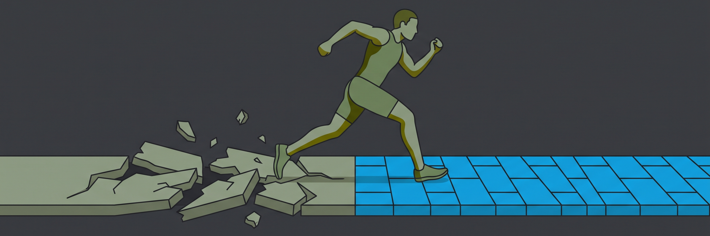
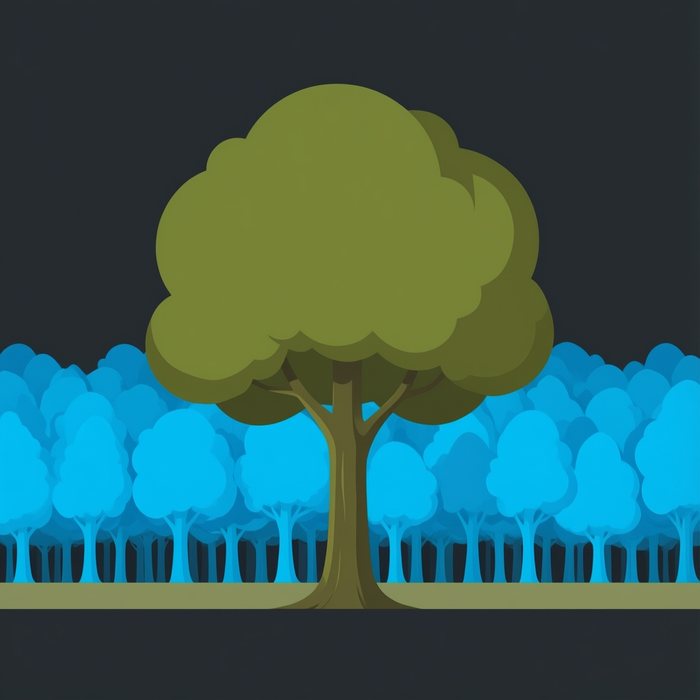
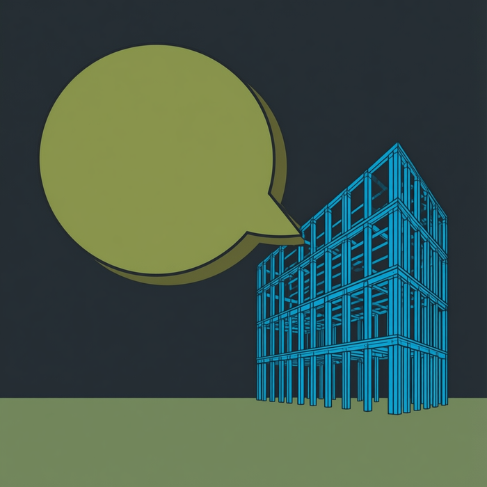

When I started software engineering, Waterfall was the typical process. A team would spend months building a large feature set, then deploy it. There were lots of reasons for it.  Hardware acquisition looked nothing like it does today. Deployments took hours, not minutes. There were far fewer frameworks and almost no standardized automation. It was costly to do individual releases and thus batching was preferred.

The batching had a time cost, though. User feedback was slower, patches took longer, and project management was more complex.

## Waterfall: Slow and Clunky

This batching led to long lead times. Long lead times killed companies. Teams ran out of money before enough revenue came in. Either the initial funding was exhausted or the main value proposition never shipped in time to generate any. Sometimes the business direction changed underneath the project, and eighteen months of careful work landed in a market that no longer existed.

<blockquote>The software wasn't necessarily bad. The timing was fatal.</blockquote>

## Agile: Misses the Forest For The Trees

<figure class="img-right"></figure>

So teams transitioned to Agile. Short sprints. Customer feedback early and often. Start with an MVP, learn, adjust. As frameworks matured, it became genuinely easier to deliver higher-functioning products. A complete product with all its feature sets still tended to take years.  With more frequent releases, revenue was coming in during the process. Throw in containerization, infrastructure as code, and faster hardware and network itself and speed was much easier to achieve.

The downside showed up later, and it showed up in the architecture.

Technical debt accrued, usually faster than anyone tracked it. Speed of development became the primary measuring stick for how teams performed. Long-term architecture and design got deferred to a "later" that rarely arrived. The motto was **"only build it if you need it"**. This motto applied to privacy and security as readily as to anything else. Why spend time on things we aren't going to make money on?

The reality: that question was never irrational. It was the correct answer given the goal of generating revenue to avoid the failures of Waterfall.

## The Trade Was Economic, Not Technical

Here is what connects thirty years of methodology arguments. Nobody chose technical debt because they liked it. Nobody deprioritized encryption or audit trails because they thought those were bad ideas.

<blockquote>Doing it right cost time, time cost money, and money ran out.</blockquote>

Every process innovation since Waterfall — Agile, DevOps, CI/CD, platform engineering — is an answer to one question: **how do we reach revenue before the money runs out?** Each one shortened the distance. None of them changed the underlying price of building a proper foundation. So teams kept borrowing against it, because borrowing was the only move available.

That's the interesting part of what's happening now. It isn't that AI writes code faster. It's that the price of the foundation changed.

## Quality Harness Provides Best Of Both Worlds

An agent turned loose without structure produces the technical debt an unstructured human team produces. And it does so at a rate nobody can review.

<blockquote>Speed alone was never the missing ingredient. We had speed. Speed is what got us here.</blockquote>

What's different is that the foundational work is the most repeatable work in software engineering. Authentication. Authorization. Audit trails. Structured logging. Encryption at rest and in transit. Accessible, consistent UI components. Data structures and algorithms combined with sound software design principles are the exact things "only build it if you need it" told us to defer, and they are also the things with the most well-established correct answers. Agents, given the right harness and guardrails, can get them done consistently. Every time, not just when there's budget for it.

That inverts the old trade. Foundations stop being the expensive part you skip to survive, and become the cheap part you get by default.

So what happens when you use the right harness and ask better questions?

## Introducing ArchitexIDE

ArchitexIDE is a Snake Eyes Software project built on exactly that premise. Its tagline is the whole thesis: **describe your business, deploy your software.**

It is not a code editor, and it is not a drag-and-drop page builder. It's a guided workflow that takes you from "I have a business" to "I have a running application" in four steps:

1. **Describe** — tell it what your business does, who you serve, and how you operate, in your language rather than a developer's.
2. **Model** — it builds a blueprint of how your business actually works, using your exact vocabulary, so the software speaks your language from day one.
3. **Generate and test** — it writes the application and tests the rules you described *before* you ever see it.
4. **Deploy and own** — standard, readable code on your own infrastructure. Any developer can pick it up and extend it. No proprietary runtime, no lock-in.

The step people underestimate is the second one, and the interview that feeds it. Before ArchitexIDE models anything, it asks a short set of deep, business focused questions about how the business actually runs. The goal is to obtain as complete an operating story as possible, what a good outcome feels like to the people living it, and where the hard judgment calls sit today. A shallow intake produces generic software: forms and tables that fit any business and therefore none.

<blockquote>Better questions in, better software out.</blockquote>

<figure class="img-left"></figure>

And the platform layer is generated along with every application. Authentication and access control, an immutable audit trail, structured logging, envelope encryption, and a shared accessible component library. Security by default, privacy by design.

This isn't a promise about the future. It's already generating applications: **Elevate - SWFL**, a wellness and sports center app with digital memberships, QR check-in, court reservations, league registration and drop-in payments; and **The Claus Experience**, a seasonal booking operation with timed-slot capacity limits, staff scheduling, secure customer logins and payments. Both started as a description of a business in plain English.

## Work in Progress

ArchitexIDE is in active development, with new capabilities shipping twice a week and written up in plain language. You can follow along or request early access at [architexide.com](https://architexide.com).

## Can Agents Code?

They can. That debate is finished.

The question is what you ask them to build, and what you refuse to let them skip. For thirty years, I have watched and heard "we'll do it right later." Sometimes, that was a rational response to a real constraint. That constraint is dissolving. "Later" is becoming an excuse.

More complete products, delivered faster, on sound engineering practices. We finally get to stop choosing two of the three.