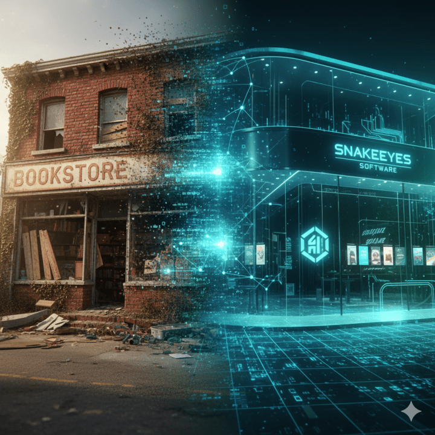

Barnes and Nobles and Borders were considered safe. Toys 'R Us was untouchable. Large numbers of people believed that brick and mortar would remain. Others argued it wouldn't. The end result, massive change. Many of those stores shuttered. Some still remain.

Today, some argue that Artificial Intelligence isn't intelligent. It is simply a token generation. It hallucinates. We'll disregard the notion that LLMs are only one type of AI, for now. This semantic argument misses the point entirely and leaves us unprepared for what's already happening.

While philosophers debate consciousness and computer scientists argue about "true understanding," AI writes code, diagnoses medical conditions, creates marketing campaigns, and processes legal documents. Yet we're still asking the wrong question: "Is it really intelligent?"

This debate isn't just academic nitpicking. It's a dangerous distraction from the practical reality unfolding around us. "Our economic and social fabric is about to change faster than any other technological advancement."

## The Five Arguments Against AI Intelligence

Critics of AI intelligence typically make any combination of five core arguments:

**The Chinese Room Argument:** AI processes symbols without understanding meaning. It follows rules but doesn't comprehend what the symbols represent. Think of someone translating Chinese by following a rulebook without speaking the language.

**The Consciousness Requirement:** Intelligence requires subjective experience and awareness. AI lacks the "what it's like" feeling of experiencing the color red or feeling pain. Without consciousness, it's sophisticated mimicry, not intelligence.

**The Embodiment Problem:** True intelligence emerges from physical interaction with the world. AI lacks sensorimotor experience that grounds human understanding. It processes text about "hot" without ever feeling heat.

**The Intentionality Gap:** Intelligent beings have genuine beliefs, desires, and intentions about the world. AI outputs responses without actually believing or wanting anything. It has no mental states directed at objects.

**The Brittleness Argument:** Real intelligence shows flexible reasoning across contexts. AI fails spectacularly outside training data, lacks common sense, and can't transfer knowledge like humans do.

## Why These Arguments Miss the Point

Each of these arguments crumbles when we apply the same logic to human intelligence.

**On Understanding:** Even if AI's understanding is shallow or mechanical, its outputs are functionally indistinguishable from human work in many domains. When you ask AI to write prose in Victorian style, it understands the stylistic requirements and delivers. That's no different than asking a human writer to adopt a specific voice. Both demonstrate comprehension through output.

**On Consciousness:** Color-blind people don't experience colors the same way others do. Those without limbs experience phantom pain in ways others can't understand. Humans experience life differently, sometimes in ways others can't comprehend. Yet we don't question their intelligence based on their unique subjective experience. There are some people who can't feel empathy. Some who lack social skills. And others who have no sense of right and wrong.

**On Embodiment:** This is a data input problem, not an intelligence problem. A blind person cannot see; a deaf person cannot hear. Their different sensory experiences don't disqualify them from intelligence. Why should AI's different input methods?

**On Intentionality:** "Once we get beyond the basic survival needs of food, clothing, and shelter, there are many who have no intentionality." Our beliefs, desires, and intentions stem from different factors. Many in the world do not know what they want to do. Look at those wandering the street mindlessly doom scrolling. Is that intentional? Or is that simply reacting to the world around them.

**On Flexibility:** Without training and learning, most humans don't show flexibility across contexts either. I won't master carpentry without training. I can barely build a drawer with wood, hammer, and nails without instruction. Human abilities are built through exposure, training, and iteration. AI systems, too, develop capability through data-driven training. Their form of learning may be different, but the result is indifferent from what a person goes through.

## The Real Consequence

While we debate whether AI "truly" understands language, it's already writing reports that influence business decisions. While we question whether it has "genuine" creativity, it's designing graphics that shape brand identities. While we argue about consciousness, AI systems coordinate with each other to solve complex problems.

The semantic debate keeps us focused on philosophical distinctions while practical transformations accelerate. We're asking "What is intelligence?" when we should be asking "How do we adapt to AI capability?"

This isn't about some distant future. Specialized AI agents are already emerging. These are systems trained like AlphaGo but for specific domains like coding, accounting, or legal research. These agents work within strict guardrails, guided by general AI systems that coordinate their efforts. They don't need consciousness or embodied experience. They just need to perform their specialized tasks better than humans.

## Focus on What Matters

The intelligence debate distracts us from preparing for real changes already in motion. Jobs won't disappear overnight, but they will transform significantly over the next decade. Some roles will vanish, others will evolve, and new ones will emerge. The question isn't whether AI deserves the label "intelligent." It's whether we're intelligent enough to prepare.

Amazon didn't need to be a "real" bookstore to transform retail. Netflix didn't need to be "real" television to change how we consume entertainment. AI doesn't need to be "truly" intelligent to reshape how work gets done.

Stop debating definitions. Start preparing for reality.
