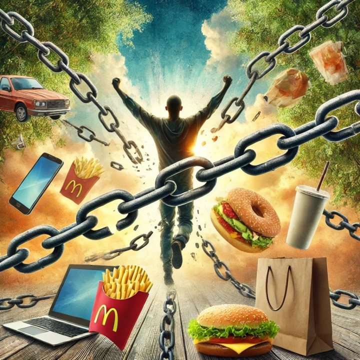
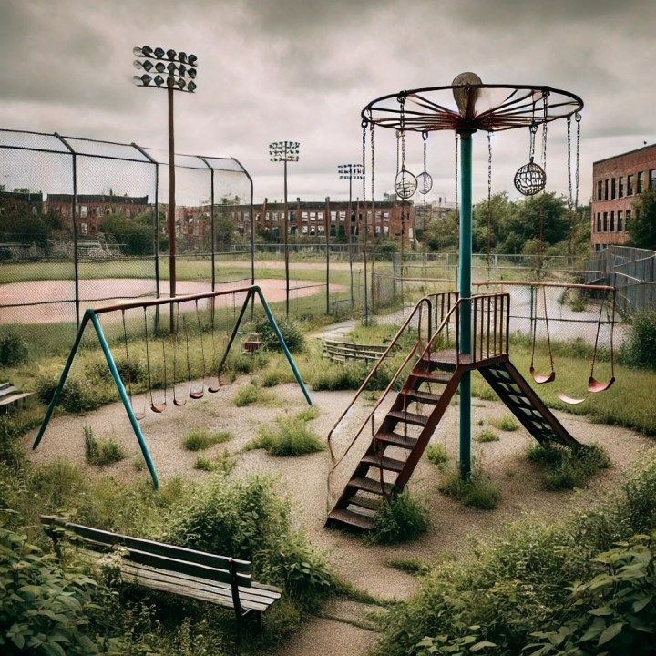

Posted on June 22, 2024

The alarm sounds. You sleepily ask your AI assistant for the weather. Wearily grab breakfast while scrolling through social media. With a few taps, you reserve a self-driving car to pick up your perfectly tailored meal – one that matches your DNA-based dietary needs, as predicted by your medical history.

Sounds perfect, right?

In our rush to make life easier, we might be losing what makes us human. Our shiny gadgets promise a brighter future, but at what cost?

We're becoming islands in a sea of technology. Our devices connect us to the world, but disconnect us from the person sitting next to us. We're trading real smiles for emoji reactions.

Dopamine receptors are being overloaded. Brains are getting rewired. Why remember phone numbers when your smartphone can do it for you? Why learn to read a map when GPS can guide you? We're outsourcing our thinking to machines.

And our bodies? They're turning into couch potatoes. Why walk when you can ride? Why cook when you can order in or have a robot chef? We're becoming masters of the remote control, but novices at real-life activities.

It's time to wake up and smell the Wifi. Buckle up – it might be an uncomfortable ride, but it's one we need to take.

Are you ready to face the truth about our tech-filled lives?

## Where Did Everyone Go?

Community used to be the center of everything. Kids outside playing. Families gathering. Those days are fading fast, and the consequences go beyond just missing a friendly face.

While there was hints at community involvement declining before, the shift to remote work expedited it. Remote work gave no commute, no dress code, no noisy coworkers.

We lost out on staying close with coworkers that became friends. Now, there's no reason to stay in one area. We can move anywhere and work from there. There's no reason to be local.

Lunch with your co-workers is now just everyone ordering Door Dash and hopping on a call. Your co-worker is getting married? Having a kid? Just have a video call celebration! There parent just passed away? No longer able to stop by to offer condolences.

Your office is now some vague set of tables with power cords and maybe some monitors. A few so called "phone booths" for privacy. Meetings over a video conferences seem like an awesome idea. It is great for people who work from home and don't have to say much on the calls. They can get a great workout in. Have to be on the calls? All those non-verbal nuances that the can be caught when in person are lost.

And let's not even talk about the new struggle of work-life balance when the work office is right next to your bedroom, kitchen, or family room. Or is it really also the sofa in front of the TV with the family together?

And it's not just work. Our whole lives are going virtual. We swipe right for love, join online book clubs, and attend virtual concerts. Can a heart emoji really replace a hug?

This shift doesn't just affect our social lives. It changes how we care for our communities. Who will volunteer at the local food bank? Who will coach the kids' soccer team? When we're not physically present, our neighborhoods suffer.

> "We're more connected than ever before. So why do we feel so lonely?"

The hard truth? We're trading real connections for convenient ones. We're building walls of technology around ourselves. And in the process, we're losing the very thing that makes us human – our sense of community. The community that is right outside our doors but is lost by those staying on their devices. We're more connected than ever before. So why do we feel so lonely?

Psychologists have long known that humans have a fundamental need for belonging. A landmark study by [Baumeister and Leary in 1995](https://www.researchgate.net/publication/15420847_The_Need_to_Belong_Desire_for_Interpersonal_Attachments_as_a_Fundamental_Human_Motivation) showed that this need is as essential. Online interactions, while valuable, don't fully satisfy this deep-seated need.

[Research](https://www.ncbi.nlm.nih.gov/pmc/articles/PMC9817115/) suggests it can't. The more time people spent online trying to build connections, the lonelier they felt in real life. These connections just aren't real enough. Everyone acknowledges this. Yet it is still heavily used and relied upon?

Even when we do go out, we're not really "there." We're too busy checking in on social media or texting friends who aren't with us. We're together, but alone.

Travel used to connect us to new places and people. Now, we zip from airport to hotel to tourist spot, all while staring at our phones. We see the world through our camera apps, not our eyes. Many with the aim of posting their "best life." Not intentionally to brag. But to share their own joy. Into the ether. A dopamine hit.

## The Atrophy of Skills

Remember when you had to memorize phone numbers? The part that used to do that hasn't transitioned to remembering passwords yet.

GPS has made getting lost a thing of the past. At least as long as the GPS data is accurate. The cost? [Studies](https://www.nature.com/articles/s41598-020-62877-0) show that relying on GPS can shrink parts of our brain responsible for navigation. We're trading our inner compass for a digital one. The users have to be intentional about thinking about directions in order to keep their own sense of direction.

I have seen way too many younger adults and kids that struggle to do simple math in their head thanks to the reliance on calculators. Even though it's usually faster to do the math in your head. Counting change for instance. Oh, wait, that's another one that might be gone soon. Digital currency and understanding the feel of money.

Our brains are like muscles. If we don't use them, they get weak. By outsourcing our thinking to gadgets, we're letting crucial skills rust away.

> "Making things easy makes it harder to do hard things."

Navy SEAL David Goggins stresses this in "Can't Hurt Me." He says we need to "callus our mind" by facing challenges head-on. In our convenience-obsessed world, are we losing our mental toughness?

Take handwriting, for example. As we type more and write less, we're losing an important cognitive tool. Research shows that writing by hand helps us learn and remember better than typing. Many who journal say that the process of journaling via paper is just a different experience.

Artificial Intelligence is creeping into every field. It can write articles, create art, even code software. It's making our lives easier, but are we becoming too dependent?

Experts warn about "[automation complacency.](https://www.mitre.org/sites/default/files/2021-11/pr-16-3426-lessons-lost-nothing-can-go-wrong-automation-induced-complacency.pdf)" That's when we trust machines so much, we stop paying attention. It's happened in plane cockpits and factory floors. Could it happen in our daily lives too?

We're gaining convenience, but at what cost? Are we trading our ability to think critically and solve problems for quick, easy answers?

The world is changing fast. New jobs appear while old ones vanish. But if we lose our basic skills and mental resilience, how will we adapt? Of course, there could be the other side — those growing up in this fast changing, technology driven world may adapt faster and become significantly more efficient at task switching (I refuse to call it multi-tasking).

As technology changes, the ability to retreive data from older technology becomes harder and harder. There has to be some consideration for how to do things in a non-technical manner.

## Where the Mind Goes, the Body Will Follow

I'm of Generation X. I grew up with an Atari, Commodore 64, 286, 386, original playstation, and the start of Cable Television. I still road bikes with my best friend and played outside. There simply wasn't the options then that there is now. And my kids remind me all the time.

Our bodies were built to move. But in our tech-filled world, we're moving less than ever. It's not just laziness – it's by design.

Need to go somewhere? Don't walk, take an e-scooter! Too far? Drive or tap for a ride-share. Even in our current neighborhood, there's teens using golf carts to go to the pool. I'd ride my bike, spend a few hours swimming, and then ride home.

Our homes are getting smarter. Robot vacuums clean our floors. Smart thermostats adjust the temperature. We don't even have to get up to turn off the lights anymore. This small amount of movements on a regular basis add up. Sure, they won't give you six packs. But they can distract you from walking to the pantry and grabbing that chocolate chip cookie.

And then there's entertainment. Why go to the park when you have endless streaming options? Why play sports when you can be a champion in video games? And I love video games. But, unless it is an organized game, kids rarely are outside just playing.

The numbers are scary. The [World Health Organization](https://news.un.org/en/story/2021/10/1103032) says 1 in 4 adults don't get enough physical activity. For teens, it's 4 in 5. We're raising a generation that might live shorter lives than their parents.

It's not just about weight. Lack of movement affects our brains too. Exercise boosts mood, improves memory, and helps us think clearly. By sitting more, we're dulling our minds.

> "We're saving time, but are we shortening our lives?"

Our convenience-driven lifestyle is creating a health crisis. Heart disease, diabetes, and depression are on the rise. We're saving time, but are we shortening our lives?

Even our social lives suffer. We're missing out on the joy of a group hike, the thrill of a pick-up game, the laughter during a dance class.

We've gone from active hunters and gatherers to sedentary screen-watchers in just a few generations. Our bodies haven't caught up to this rapid change.

The irony? We have fitness trackers on our wrists, telling us to move more. But we're too busy checking our phones to listen. It's a good thing we are finding all these productivity hacks to increase free time to go lift weights to get in shape.

## Humans Crave Convenience

Human brains want to conserve energy. It's a survival instinct that has been engrained for many years. That instinct doesn't understand there is a point where conserving energy becomes detrimental. The body just compensates for it in other ways. Or, it lets itself deteriorates until the brain recognizes there is a problem.

We have to be aware of this. This isn't some luddite anti-technology view. This is a call to be aware and intentional of how technology is used and consumed. Human's are social creatures by nature. The attention economy has made it so seem that on line connections are the same. They aren't. The tech sector has made it seem that virtual environments will be the same as real. They aren't.

You can choose your hard. You can choose it now. Or choose it later.

---

**Author's Note:** I started this article before I saw Daniel Miessler's Fast Slow problem. He goes at it from a slightly different angle. I highly recommend following him. [https://danielmiessler.com/p/the-fast-slow-problem](https://danielmiessler.com/p/the-fast-slow-problem)
