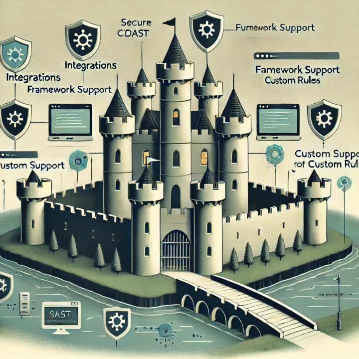
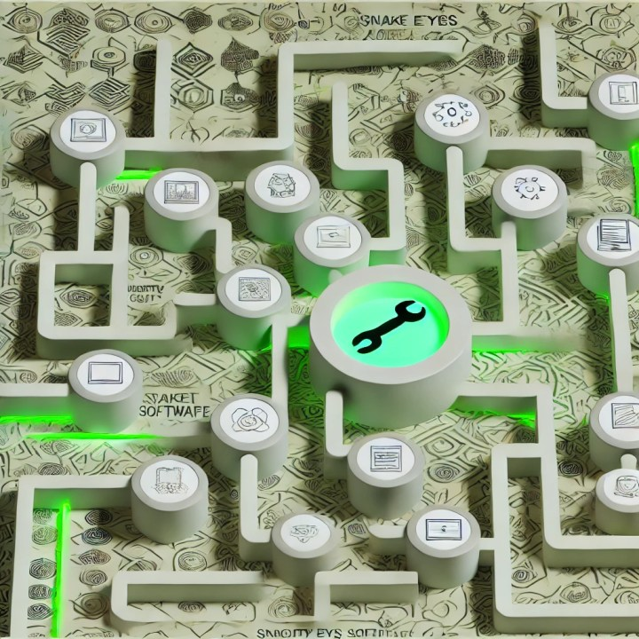

Security tools have become commoditized, with numerous vendors offering overlapping features. However, each tool maintains a competitive advantage through unique combinations of support, capabilities, and integrations that create significant switching costs.

## Language and Framework Support

Most tools cover popular programming languages, but differences emerge in specialized framework support and architectures. For instance, when Single Page Applications became prevalent, some DAST tools struggled with crawling capabilities. Authentication mechanisms and other technical nuances also vary between vendors.

## Vulnerability Classes and Recommendations

While scanning tools share similar core functionality, they differ in their ability to identify specific vulnerability types and provide remediation guidance. Some offer custom rules—a feature that becomes deeply embedded in security pipelines. Language-specific recommendations and example code vary significantly between platforms.

> "At their basic level, nearly all scanning tools are rules engines"

## Scanning Engines

Different SAST, RASP, IAST, and DAST tools employ distinct processor architectures for code evaluation. Two tools supporting identical languages and frameworks may produce different results based on their underlying scanning capabilities.

## Integrations

Tools become embedded across multiple touchpoints: IDEs, source repositories, CI/CD pipelines, container builds, and enterprise systems like ticketing and SSO platforms. This extensive integration makes switching a major undertaking.

## Results Management

Tool migration creates complexities around findings reconciliation. Organizations must decide whether to transfer historical findings or start fresh, and how to validate fixes when new tools don't detect previously identified issues.

## The Cost of Crossing the Moat

Swapping security tools requires more than installation—it demands rebuilding workflows, developer habits, and integration infrastructure. While new tools emerge constantly, the investment required to migrate remains substantial, explaining why "the cost of tools has yet to really come down."
