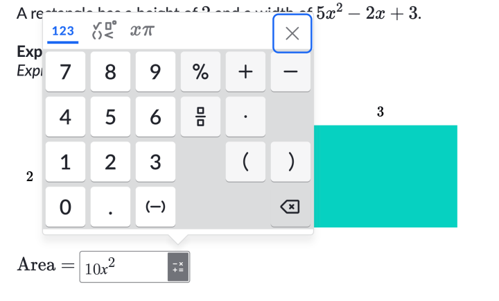

*Human Computer Interaction is difficult. Options are endless.*

Software frequently impedes user workflows, creating frustration that erodes trust between users and systems. This problem extends beyond mere inconvenience—it carries security implications that deserve attention.

## The Challenge of Modern User Experience

Contemporary software attempts to serve multiple contexts simultaneously: desktop browsers, tablets, and mobile devices. User interface designers must balance countless factors including accessibility standards, evolving authentication methods (from passwords to facial recognition and passkeys), and rapidly shifting technology capabilities.

Voice interaction exemplifies this evolution. Once limited to specialized applications, voice commands are becoming mainstream through AI and large language models. The concept of conversational software—telling a 3D printer "Earl Grey" or voice-activated bartenders—no longer seems far-fetched.

## Google Search: A Case Study

Google's search interface demonstrates how incremental UI changes accumulate. Originally simple and intuitive, the interface now includes suggested searches, advertisements, and sponsored results that bury relevant content deeper. Yet users persist with Google despite these changes.

> Users typically scroll past the ads, yet Google keeps pushing them more and more.

Why haven't users migrated? Habit and marketing likely play significant roles, combined with the absence of friction in switching costs.

## Online Education Interfaces: Where Complexity Becomes Problematic

*A calculator popup to enter in the answer in a popular platform.*

Math education platforms particularly suffer from poor interface design. Complex mathematical input—exponents, equations, fractions—requires cumbersome workarounds via calculator popups. This disrupts learning flow compared to traditional pencil-and-paper methods.

Common issues include:
- Inadequate feedback during problem-solving processes
- Binary grading that punishes format errors despite correct reasoning
- Inconsistent treatment of equivalent answers (decimals vs. fractions marked incorrect)
- Limited true partial credit systems

These limitations frustrate learners and encourage them to seek workarounds rather than engage authentically with the material.

## Security Implications of Poor UI Design

The connection between interface frustration and security risk lies in **integrity**—not merely data integrity, but the user's ability to trust that the system performs as promised.

When interfaces obstruct legitimate workflows, users become motivated to circumvent them. This motivation mirrors historical precedents: people once recorded music off the radio because purchasing full albums proved expensive. Similarly, inadequate educational software pushes users toward shortcuts.

From a security perspective, this creates ambiguity: system defenders cannot easily distinguish between legitimate problem-solving and malicious circumvention attempts.

## The Bottom Line

"The user interface can reward or punish the user. The user interface...is the first line of building trust and the first line of securing an application." When design gets in the way, security suffers alongside user experience.
