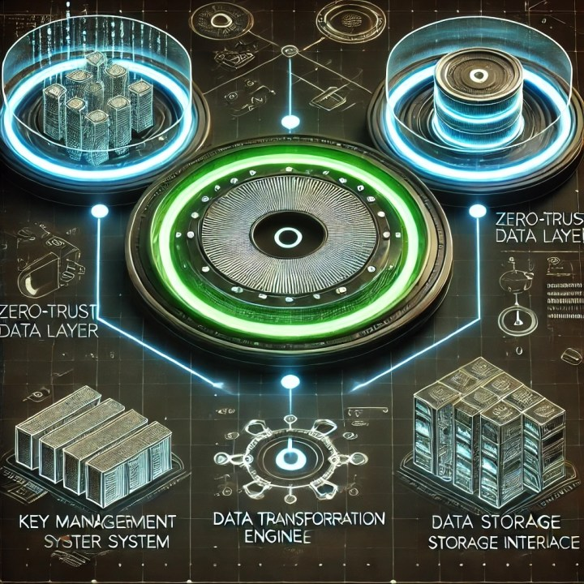

Posted on January 17, 2025

## Understanding Software Complexity

Software is inherently complex—composed of many interconnected parts that weave together like "spaghetti code." To manage this complexity, engineers have developed organizational strategies and higher-level programming languages that abstract machine code, making systems more readable and maintainable.

However, this capability has enabled increasingly complex software, which in turn has driven reliance on additional organizational techniques and third-party libraries.

## The Evolution of Encryption

Encryption technology has undergone significant transformation. Previously, encryption was computationally expensive and impacted user experience, so organizations limited its use to high-threat scenarios. This preference for disk-level encryption over data-level encryption meant internal network traffic was often considered trusted.

Today's landscape differs dramatically. Encryption is now fast and efficient, making arguments against encrypting internal traffic obsolete.

## Compliance Requirements

Modern compliance frameworks—PII, PCI DSS, and PHI standards—exist because specific datasets possess distinct vulnerabilities and value. Each addresses particular risks:

- **PII** captures enable identity theft
- **PCI DSS** violations facilitate financial fraud
- **PHI** breaches expose medical history and violate confidentiality

These requirements mandate that organizations implement controls ensuring sensitive data receives appropriate care, with auditors verifying effectiveness.

## Access Control Challenges

> "Disk-level encryption doesn't protect against authenticated users, and database-level encryption remains vulnerable to those with elevated privileges."

Traditional access controls present significant problems. Determining sufficient encryption levels, identifying sensitive data (including metadata like IP addresses), and managing encryption across systems creates substantial complexity.

Key management introduces additional layers: initial data encryption, managing encrypted backups, handling encrypted data in event-driven systems, and addressing logging requirements.

**The reality:** Most application data layers prioritize functionality over security. What's needed is a zero-trust data layer embedded fundamentally within the application layer.

## The Cost Argument

A common objection compares this approach to physical construction: you wouldn't build a skyscraper foundation the same way as a house foundation. However, this analogy breaks down in the digital realm.

The cost of implementing comprehensive encryption is orders of magnitude less than overbuilding physical infrastructure. Digital and physical constraints differ fundamentally.

## Zero-Trust Data Layer Architecture

A foundational zero-trust approach requires three primary components:

### 1. Key Management System
- Handles encryption key lifecycle
- Assigns unique keys to each data element
- Encrypts individual keys with master keys, creating a hierarchical structure
- Provides fine-grained access control and seamless key rotation
- Uses the hierarchy to implement authorization controls—without decryption capability, access is denied

### 2. Data Transformation Engine
- Manages encryption and decryption operations between application and storage layers
- Maintains searchability and sortability of encrypted data through specialized index generation
- Preserves functionality without exposing raw data

### 3. Storage Interface
- Abstracts encrypted data management complexity
- Handles initialization vectors, key identifiers, and version information
- Maintains consistency and atomicity across structured and unstructured data
- Manages associated metadata

## Performance Considerations

Contrary to expectations, field-level encryption overhead has largely disappeared with modern hardware acceleration. The real performance challenges emerge elsewhere:

**Search Operations:** Developers face a dilemma—decrypt all data (severe performance penalties) or maintain secondary indexes (increased storage and complexity). Specialized encryption schemes like homomorphic or searchable encryption provide solutions but require selective application.

**Key Management:** Scaling to billions of individual keys demands careful hierarchy design and strategic caching. Derivable keys offer an elegant approach, generating individual data keys deterministically from master keys and metadata while preserving per-record encryption security.

## Usability and Framework Design

Success requires matching the usability of traditional data access frameworks, with encryption operations handled transparently. Developers need input only for critical decisions about searchability and access patterns.

## Algorithm Rotation Strategy

As vulnerabilities emerge or quantum computing threatens existing cryptographic methods, systems must support seamless transitions. A versioned encryption approach solves this challenge.

Each data element carries metadata about both its encryption key and algorithm version. This enables sophisticated multi-algorithm strategies supporting graceful transitions without system downtime.

### Implementation Strategy

**Write Operations:** Consistently use the preferred algorithm, storing key and algorithm metadata alongside each data element.

**Read Operations:** Implement lazy re-encryption—upon detecting outdated encryption, decrypt with the original algorithm, re-encrypt using the current standard, and update asynchronously.

This organic rotation occurs through normal data access patterns, while background processes handle less-frequently accessed data.

## Operational Complexity

Versioned encryption introduces specific challenges:

- Maintain perfect backward compatibility during rotation periods
- Handle concurrent requests across multiple algorithm versions without compromising integrity
- Manage database query performance with data encrypted across multiple versions
- Prevent performance degradation through strategic rate limiting and off-peak scheduling
- Implement sophisticated recovery mechanisms for system failures during re-encryption

## Operational Controls and Monitoring

Production deployment demands sophisticated monitoring and control systems:

### Metrics to Surface
- Algorithm version distribution
- Re-encryption progress and velocity
- Failed operation detection
- Performance impact analysis
- Legacy algorithm access patterns

### Granular Controls Required
- Re-encryption pause and resume capabilities
- Load-based rate adjustment
- Dataset prioritization
- Emergency halt procedures

These controls must operate within zero-trust principles, enabling management without exposing sensitive data or keys.

## The Business Case

The architectural complexity of zero-trust data layers may appear excessive for smaller systems. However, this complexity directly addresses catastrophic breach risks. The implementation challenges already exist in current systems—distributed across inconsistent implementations, patches, and incident response procedures.

Centralizing zero-trust handling within a well-designed framework transforms ad-hoc security measures into systematically managed components. While initial investment is substantial, it pales against accumulated costs of breaches, remediation, and compliance violations.

As adoption spreads, per-application costs decrease dramatically, following the pattern of database engines and web servers—eventually becoming standardized components.

## Conclusion

Software architecture must embrace zero-trust data handling as a fundamental requirement rather than an optional feature. The technical foundation exists, the business case is clear, and proactive adoption offers the only alternative to reactive security driven by inevitable breaches.
